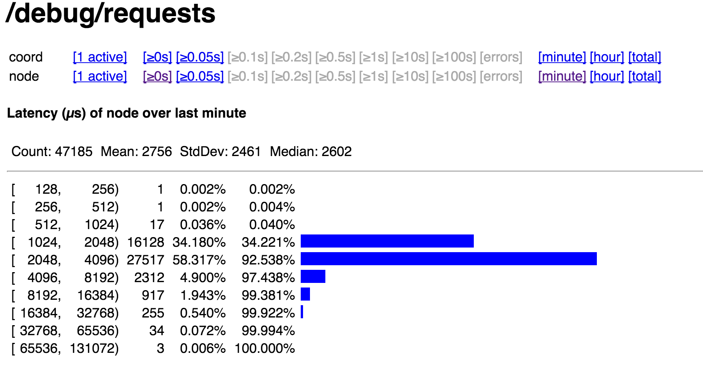

# Performance baselines

using the acceptance `Put` test (three writers on the first node), with splits disabled and 8kb values for short periods of time (~minute). Used the standard certs (Docker used shorter 1024bit ones).

| Setting | Op           | ~ kreq/s |
|---------|--------------|---------|
| bare-*x | Get empty    | 6       |
| bare-1x | Put 8k       | 2.5     |
| bare-3x | Put 8k       | 1       |
| dckr-3x | Put 8k       | .3      |

The `Put` performances degrade over time (also not unexpected).

## Typical Put Traces

essentially (and not surprisingly), almost all of the time is spent in Raft. The traces below are Docker-3x Put, but the bare bone tests are similar (just faster).

```
2015/10/28 15:33:07.628291	0.117887	c46387386294295.77
15:33:07.628292	 .     1	... node
15:33:07.628302	 .    10	... executing 1 requests
15:33:07.628305	 .     3	... read-write path
15:33:07.628307	 .     3	... command queue
15:33:07.628313	 .     5	... command queue [end]
15:33:07.628314	 .     1	... raft
15:33:07.745885	 .117572	... applying batch
15:33:07.746094	 .   209	... applying batch [end]
15:33:07.746165	 .    70	... raft [end]
15:33:07.746166	 .     2	... read-write path [end]
15:33:07.746168	 .     1	... executing 1 requests [end]
15:33:07.746173	 .     5	... node [end]
```
```
2015/10/28 15:33:03.922944	0.062136	c46383714118910.1
15:33:03.922949	 .     5	... node
15:33:03.922969	 .    20	... executing 1 requests
15:33:03.922976	 .     7	... read-write path
15:33:03.922982	 .     6	... command queue
15:33:03.922993	 .    11	... command queue [end]
15:33:03.922998	 .     5	... raft
15:33:03.984659	 . 61662	... applying batch
15:33:03.984823	 .   164	... applying batch [end]
15:33:03.985069	 .   246	... raft [end]
15:33:03.985070	 .     1	... read-write path [end]
15:33:03.985071	 .     1	... executing 1 requests [end]
15:33:03.985076	 .     5	... node [end]
```

Moving to single-node where no external communication is necessary, Raft fares
much better, clocking in at about double the actual engine write (bare metal
below).

```
015/10/28 13:14:00.894964	0.000707	c52440894625775.83
13:14:00.894967	 .     3	... node
13:14:00.894987	 .    20	... executing 1 requests
13:14:00.894995	 .     8	... read-write path
13:14:00.895000	 .     5	... command queue
13:14:00.895011	 .    11	... command queue [end]
13:14:00.895013	 .     3	... raft
13:14:00.895379	 .   366	... applying batch
13:14:00.895571	 .   192	... applying batch [end]
13:14:00.895651	 .    80	... raft [end]
13:14:00.895653	 .     1	... read-write path [end]
13:14:00.895653	 .     1	... executing 1 requests [end]
13:14:00.895663	 .     9	... node [end]
```

## Typical Get trace

```
2015/10/28 12:57:44.018268	0.000144	c51464017762262.22
12:57:44.018275	 .     7	... node
12:57:44.018294	 .    19	... executing 1 requests
12:57:44.018298	 .     4	... read-only path
12:57:44.018301	 .     3	... command queue
12:57:44.018306	 .     6	... command queue [end]
12:57:44.018387	 .    81	... read-only path [end]
12:57:44.018388	 .     1	... executing 1 requests [end]
12:57:44.018406	 .    18	... node [end]
```

## Bare metal setup

* standard certs
* `./cockroach start --log-dir=/tmp/data0 --verbosity=1 --alsologtostderr=true --logtostderr=true --stores=ssd=/tmp/data0 --gossip=127.0.0.1:8080 --addr=127.0.0.1:8080`

Histogram of three-node Put test:


